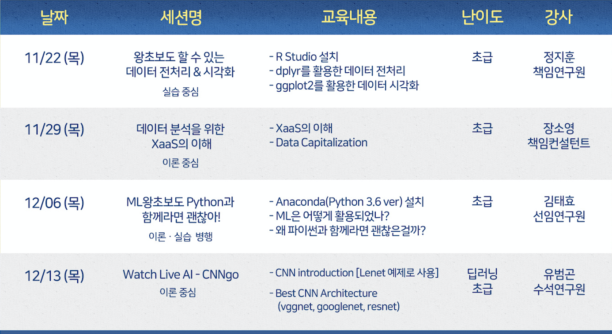

# BigAlMot_01
```
데이터플로에서 진행하는 빅데이터 전문가 양성을 위한 파일럿 교육 프로그램 입니다.
빅알못(빅데이터를 알지 못하는) 여러분들에게 조금이나마 도움이 될 수 있다면 저희는 큰 영광입니다.
```

- [목 차](https://github.com/df-AI/BigAlMot_01#bigalmot_01)
 
  - [1. 세부계획](https://github.com/df-AI/BigAlMot_01#1-세부계획)
    
  - [2. 강의안](https://github.com/df-AI/BigAlMot_01#2-강의안)


## 1. 세부계획

- 일 정 : 2018. 11. 22 ~ 12. 13 / 매주 목요일 19:00 ~ 21:00

- 장 소 : FASTFIVE 강남 2호점(강남역 4번 출구앞, 미왕빌딩 12층)

- 정 원 : 입금 선착순 10명 이내(인원 초과시 환불조치)

- 내 용


- 신청방법
  - 입금계좌 : (주)데이터플로 중소기업은행 065-140243-01-017
  - 수강료 : 각 세션당 5,000원(간식비로 제공)
  
- 참고사항
  - 수강생은 개인 노트북PC 지참

## 2. 강의안
  - [Session1(왕초보도 할 수 있는 데이터 전처리 & 시각화)](./Session1)
    - 진행방식 : 실습위주
      - 언어 : R
      - 사용툴 : RStudio
      
    - 목표
      - 개인 PC에서 RStudio 설치
      - dplyr, ggplot2 패키지 다운 및 호출
      - 데이터 전처리 이후 시각화
    
  - [Session2(데이터 분석을 위한 클라우드 인프라 이해)](./Session2)
    - 진행방식 : 이론위주
    
    - 목표
      - lass / paas / saas / faas / daas 개념을 이해
      - 데이터 분석 업계의 최신기술 및 트렌드 이해
      
  - [Session3(ML왕초보도 Python과 함께라면 괜찮아)](./Session3)
    - 진행방식 : 이론 + 실습
      - 언어 : Python(ver 3.6)
      - 사용툴 : Jupyter Notebook
     
    - 목표
      - 개인 PC에서 
    
  - [Session4(CNN의 이해)](./Session4)


***
